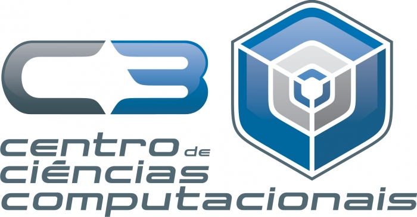

    
    

    

# 3DReconstruction
**3DReconstruction** é uma aplicação voltada para a recontrução 3D com base em dados obtidos de um sonar MSIS.

O projeto é fruto do trabalho de conclusão do curso de Engenharia de Computação na Universidade Federal do Rio Grande (FURG), desenvolvido pelo graduando **Bruno Henrique Justo**, no ano de 2018.
O projeto é desenvolvido junto ao Grupo de Automação e Robótica Inteligente (NAUTEC) do Centro de Ciências Computacionais (C3)

Os dados de entrada da aplicação deve possuir o mesmo formato dos arquivos presentes na pasta   *inputs/*.

